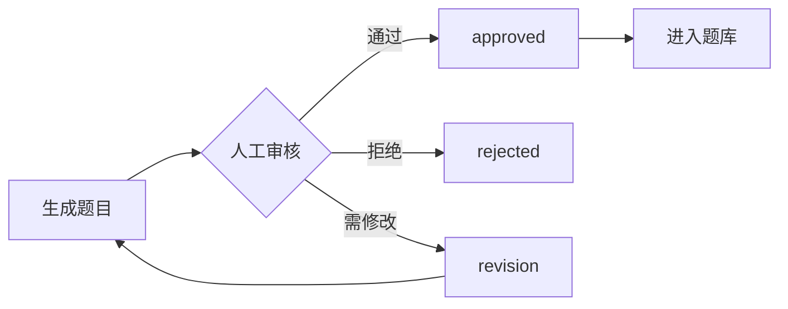
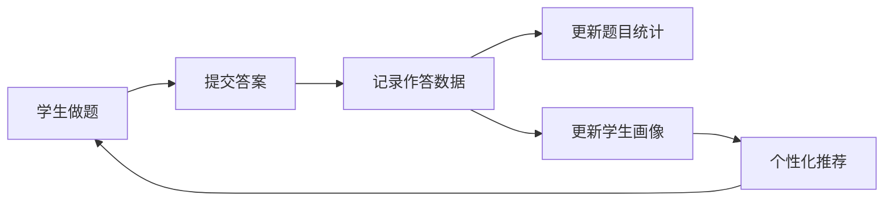
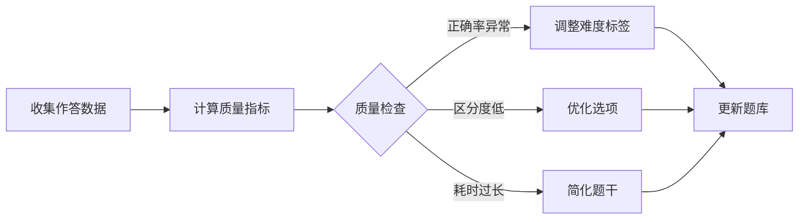

# Math Seckill Backend API v2.0 使用指南

## 概述

v2.0版本引入了基于数据驱动的题库质量管理和个性化推荐系统，旨在提高学生的真实考试通过率。

### 核心理念

**提高通过率 = 考点贴近 + 题感贴近 + 数据驱动 + 持续迭代**

---

## 新增功能

### 1. 扩展的题目数据模型

每道题目现在包含丰富的元信息：

```json
{
  "questionId": "trig_L1_c_001",
  "topic": "三角函数",
  "difficulty": "L1",
  "type": "choice",

  "knowledgePoints": ["三角函数", "定义域"],
  "abilityTags": ["memory", "understand"],
  "templateId": "trig_domain_range",

  "source": "generated",
  "isRealExam": false,

  "totalAttempts": 1523,
  "correctRate": 0.586,
  "discriminationIndex": 0.67,

  "reviewStatus": "approved"
}
```

### 2. 作答记录追踪

系统自动记录每次学生答题：

- 学生ID
- 题目ID
- 用户答案
- 是否正确
- 耗时

### 3. 题目质量统计

自动计算：

- **正确率**：反映题目难度
- **区分度**：高分组正确率 - 低分组正确率
- **平均耗时**：反映题目复杂度
- **选项分布**：检测迷惑项质量

### 4. 学生能力画像

为每个学生生成：

- **知识点掌握度**：每个知识点的正确率
- **题型正确率**：选择/填空/解答的正确率
- **难度正确率**：L1/L2/L3的正确率
- **薄弱知识点**：正确率<0.6的知识点
- **预测分数**：基于当前数据预测考试分数

### 5. 个性化推荐

三种推荐模式：

#### 薄弱知识点模式 (`weak_points`)
- 70%：薄弱知识点的L1+L2题
- 20%：已掌握知识点的L2+L3题（巩固）
- 10%：随机新题（拓展）

#### 综合训练模式 (`comprehensive`)
- 按考试蓝图分布：L1(50%) + L2(35%) + L3(15%)

#### 考前冲刺模式 (`exam_prep`)
- 80%：薄弱知识点的L2题
- 20%：高频错题重练

---

## API接口

### 基础接口

#### `GET /`
健康检查

**响应**:
```json
{
  "status": "ok",
  "version": "2.0.0"
}
```

---

### 题库管理

#### `GET /api/questions/stats`
获取题库统计信息

**响应**:
```json
{
  "total": 436,
  "difficultyStats": {
    "L1": 218,
    "L2": 152,
    "L3": 66
  },
  "typeStats": {
    "choice": 300,
    "fill": 100,
    "solution": 36
  },
  "reviewStats": {
    "pending": 200,
    "approved": 236
  }
}
```

#### `GET /api/questions/{questionId}`
获取单个题目详情

#### `POST /api/questions`
创建新题目

**请求体**:
```json
{
  "questionId": "custom_001",
  "topic": "导数",
  "difficulty": "L1",
  "type": "choice",
  "question": "...",
  "answer": "A",
  "solution": "...",
  "options": ["...", "...", "...", "..."],
  "knowledgePoints": ["导数", "单调性"],
  "abilityTags": ["apply"],
  "source": "manual",
  "reviewStatus": "pending",
  "createdAt": "2025-12-02T12:00:00"
}
```

#### `PUT /api/questions/{questionId}`
更新题目

#### `DELETE /api/questions/{questionId}`
删除题目

---

### 作答记录

#### `POST /api/answers/submit`
提交答案

**请求体**:
```json
{
  "studentId": "user123",
  "questionId": "trig_L1_c_001",
  "userAnswer": "A",
  "timeSpent": 45
}
```

**响应**:
```json
{
  "success": true,
  "recordId": "uuid...",
  "isCorrect": true
}
```

#### `GET /api/answers/student/{studentId}`
获取学生的所有作答记录

---

### 质量统计

#### `GET /api/admin/question/{questionId}/stats`
获取题目质量统计

**响应**:
```json
{
  "questionId": "trig_L1_c_001",
  "totalAttempts": 1523,
  "correctCount": 892,
  "correctRate": 0.586,
  "avgTimeSeconds": 45.2,
  "discriminationIndex": 0.67,
  "optionDistribution": {
    "A": 0.12,
    "B": 0.25,
    "C": 0.586,
    "D": 0.044
  }
}
```

#### `POST /api/admin/question/update-stats`
更新题目质量统计（管理员）

---

### 学生画像

#### `GET /api/student/{studentId}/profile`
获取学生能力画像

**响应**:
```json
{
  "studentId": "user123",
  "knowledgeMastery": {
    "导数": 0.75,
    "极限": 0.60,
    "积分": 0.45
  },
  "questionTypeAccuracy": {
    "choice": 0.80,
    "fill": 0.65,
    "solution": 0.50
  },
  "difficultyAccuracy": {
    "L1": 0.90,
    "L2": 0.60,
    "L3": 0.30
  },
  "totalProblems": 150,
  "correctCount": 105,
  "avgTimePerProblem": 38.5,
  "weakPoints": ["极限", "积分"],
  "predictedScore": 72.5,
  "updatedAt": "2025-12-02T12:00:00"
}
```

---

### 个性化推荐

#### `POST /api/student/recommend`
推荐题目

**请求体**:
```json
{
  "studentId": "user123",
  "mode": "weak_points",
  "count": 20
}
```

**mode选项**:
- `weak_points`: 薄弱知识点模式
- `comprehensive`: 综合训练模式
- `exam_prep`: 考前冲刺模式

**响应**:
```json
{
  "questions": [
    {
      "questionId": "...",
      "question": "...",
      ...
    }
  ],
  "recommendationReason": "基于您的学习数据：薄弱知识点：极限, 积分 | 巩固强项：导数 | 拓展新题"
}
```

---

### 审核管理

#### `POST /api/admin/review`
审核题目

**请求体**:
```json
{
  "questionId": "trig_L1_c_001",
  "reviewerId": "admin001",
  "status": "approved",
  "comment": "题目质量良好，通过审核"
}
```

**status选项**:
- `pending`: 待审核
- `approved`: 已通过
- `rejected`: 已拒绝
- `revision`: 需修改

---

## 数据迁移

如果你有现有的题库数据，需要迁移到v2格式：

```bash
cd tools
python migrate_to_v2.py ../data/questions.json
```

脚本会：
1. 自动备份原文件（`questions_backup.json`）
2. 推断知识点和能力标签
3. 添加质量统计字段（初始化为0）
4. 设置审核状态为`pending`
5. 生成迁移统计报告

---

## 题型模板系统

### 使用预定义模板生成题目

```python
from core.problem_templates import generate_from_template

# 生成一道L1难度的三角函数定义域选择题
problem = generate_from_template(
    template_id="trig_domain_range",
    difficulty="L1",
    question_type="choice"
)
```

### 可用模板

| 模板ID | 类别 | 名称 | 难度 | 题型 |
|--------|------|------|------|------|
| `trig_domain_range` | 三角函数 | 定义域和值域 | L1 | choice |
| `trig_identity` | 三角函数 | 恒等式化简 | L2 | fill |
| `quadratic_discriminant` | 代数 | 一元二次方程判别式 | L1, L2 | choice, fill |

### 列出所有模板

```python
from core.problem_templates import list_templates, TemplateCategory

# 列出所有三角函数模板
trig_templates = list_templates(category=TemplateCategory.TRIGONOMETRY)

# 列出所有L1难度模板
l1_templates = list_templates(difficulty="L1")
```

---

## 工作流程

### 1. 题目生成与审核



### 2. 学生刷题与数据收集



### 3. 质量监控与优化



---

## 最佳实践

### 1. 题目设计

- ✅ 参考真题结构
- ✅ 明确知识点标签
- ✅ 设计有迷惑性的错误选项
- ✅ 提供详细解析
- ❌ 不要题干过长
- ❌ 不要选项一眼排除

### 2. 数据驱动优化

定期检查：
- 正确率偏差>15%的题目
- 区分度<0.3的题目
- 某个选项<5%的题目

### 3. 推荐策略

- 新用户：使用`comprehensive`模式
- 有作答记录：使用`weak_points`模式
- 考前冲刺：使用`exam_prep`模式

---

## 技术架构

```
math_seckill_server/
├── core/
│   ├── problem_generator.py      # 题目生成器
│   ├── problem_templates.py      # 题型模板
│   ├── question_bank.py          # 题库管理
│   ├── answer_tracker.py         # 作答记录追踪
│   ├── recommender.py            # 个性化推荐
│   └── grading.py                # 判分逻辑
├── data/
│   ├── questions.json            # 题库数据
│   └── answer_records.json       # 作答记录
├── tools/
│   └── migrate_to_v2.py          # 数据迁移脚本
├── schemas.py                     # 数据模型
└── main.py                        # FastAPI应用
```

---

## 下一步计划

### 短期（已完成 ✅）
- [x] 题目元信息完善
- [x] 作答记录系统
- [x] 质量统计计算
- [x] 学生能力画像
- [x] 个性化推荐算法
- [x] 审核流程

### 中期（进行中 🚧）
- [ ] 真题收集和标注
- [ ] 扩展题型模板库（目标20+模板）
- [ ] 模拟考试模式
- [ ] 错题本功能

### 长期（规划中 📋）
- [ ] 自动难度调整
- [ ] 题目质量自动评分
- [ ] A/B测试不同出题策略
- [ ] 大数据分析考试趋势
- [ ] 预测分数准确度优化

---

## 常见问题

### Q: 如何批量导入真题？

A: 准备JSON格式的真题数据，使用`POST /api/questions`批量创建，并标记`isRealExam: true`。

### Q: 推荐算法如何工作？

A: 基于学生的历史作答记录，计算知识点掌握度，优先推荐薄弱知识点的题目。

### Q: 如何保证题目质量？

A: 采用"生成→审核→上线→数据反馈→优化"的闭环流程，持续提升题目质量。

### Q: 预测分数准确吗？

A: 初期可能偏差较大，随着数据积累会逐步提高准确度。建议至少50道题后参考预测分数。

---

## 联系与支持

如有问题或建议，请提交Issue或联系开发团队。


